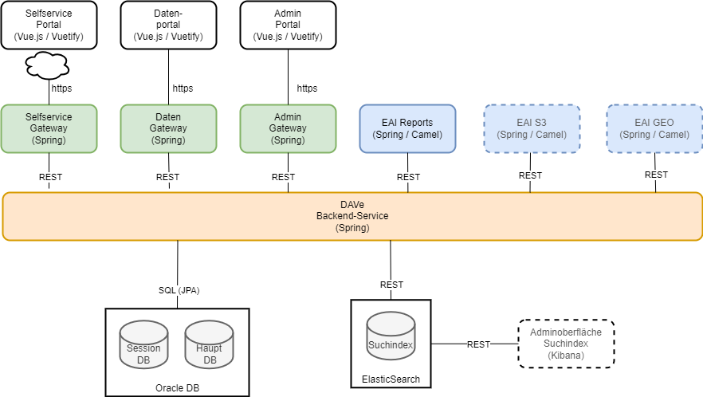

# Dokumentation

## Architektur

## Technisches Setup
Zum schnellen Starten eines vollständig lauffähigen DAVe Datenportal ist im Verzeichnis "stack" ein docker-compose-Skript verfügbar. 
Dieses fährt folgende Komponenten hoch:
* ElasticSearch
* Kibana
* H2-Datenbank
* DAVe-Backend
* DAVe-Frontend (Datenportal)

Die Security-Funktionen für Login etc. sind dabei ausgeschaltet.

Mit dem voreingestellten Profil "sample" wird eine Beispiel-Zählstelle mit einer Beispielzählung in die Datenbank bzw. den Index eingespielt.

Das Frontend ist nach dem Hochfahren unter "http://localhost:8082" verfügbar.