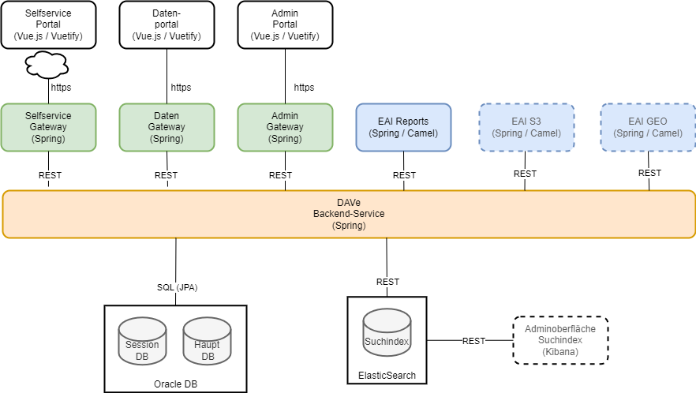

# Developer Documenation

## Build & Run

* Execute Dev Setup steps to start DAVe stack
* run mvn clean install
* run apigateway/runLocalNoSecurity.sh

## Architecture

## Dev Setup

* Clone repository for [DAVe Backend](https://github.com/starwit/dave-backend)
* Run Docker Compose file
* Import sample data
* Start Backend via Maven / Docker
* Start Frontend
* Open: http://localhost:8081
* Optional: run npm run dev
* Open: http://localhost:8082

### Coding Conventions

We use the [itm-java-codeformat](https://github.com/it-at-m/itm-java-codeformat) project to apply code formatting conventions.
To add those conventions to your favorite IDE, please have a look at the [README of itm-java-codeformat](https://github.com/it-at-m/itm-java-codeformat#verwendung).